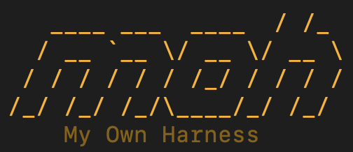

<div align="center">



# moh

**Your terminal, with a coding agent inside.**

[](https://github.com/Marco-Cricchio/moh/releases/latest)
[](LICENSE)

<div align="center">

</div>

*Open source · MIT licensed · Runs on macOS and Linux · No Node, no Bun, no npm required*

**🌐 [moh.sh](https://moh.sh)**

</div>

---

## What is moh?

moh is a coding agent that lives in your terminal: you describe what you want
in plain language, and moh reads your code, edits files, runs commands, and
gets the work done — showing you every step and asking permission before
anything risky.

Three things make it different:

- **It works with the AI provider you choose.** Anthropic, OpenAI, Google,
  GitHub Copilot, OpenRouter, Kimi, xAI — plus 16 pre-built hosted
  OpenAI-compatible endpoints (DeepSeek, Groq, Cerebras, Mistral, Moonshot,
  …) and local models too (Ollama, LM Studio), all through one
  configuration. If a provider goes down, moh falls back to the next one on
  your list. Your agent setup is never locked to a single vendor.
- **Your data stays yours.** Sessions, memory, and notes live in a plain
  append-only log on your machine (`~/.moh/`) — nothing is ever deleted, and
  you can resume, fork, or compact any session at any time.
- **It asks before it acts.** A layered permission system gates every file
  write and every shell command; extensions can veto actions but can never
  grant more than you allowed.

## Why moh?

The terminal is where developers already live. moh brings a capable, careful
AI collaborator there — one you can trust and inspect:

- **You're never locked in.** Pick your favorite provider; if one goes down,
  moh quietly falls back to the next on your list.
  → [Providers and models](docs/manual/providers-and-models.md)
- **Your data stays yours.** Every conversation, memory, and note lives on
  your machine, in plain files you can read, back up, or delete. Nothing
  is ever silently rewritten, nothing is phoned home. Move a session to
  another computer with one command.
  → [Sessions](docs/manual/sessions.md)
- **It asks before it acts.** Writing a file, running a shell command,
  clicking a button on a web page — every potentially risky action passes
  through layered rules that *you* control. And moh shows you everything
  it does, step by step.
  → [Permissions](docs/manual/permissions.md)

## What can it do?

### The essentials

- **A friendly terminal interface.** Arrow through your past sessions, pick
  up where you left off, watch the answer stream in, and send follow-ups
  while it works. Prefer no interface at all? Run it scriptable and
  unattended (`moh run`) for CI and automation.
  → [Getting started](docs/manual/getting-started.md) ·
  [Commands and keys](docs/manual/commands-and-keys.md)
- **It reads your project.** Point at files and folders just by typing `@`,
  drag and drop images in, and moh builds a live mental map of your
  codebase — so its answers are about *your* code, not generic advice.
  → [What moh offers](docs/manual/what-moh-offers.md)
- **It works in steps, and you see them.** Files edited, commands run, pages
  visited, tokens spent — everything is visible, everything is logged,
  everything can be reviewed later.
  → [Sessions](docs/manual/sessions.md)

### Around your code

- **Moh Project Map.** Before touching a big codebase, moh quietly builds a
  structural map of it — which files relate to which, where things live.
  When you then ask for a change, it starts with a cited, source-backed plan
  instead of wandering around. You can ask it to explain the map, too
  ("where is the quota logic?").
  → [What moh offers](docs/manual/what-moh-offers.md)
- **Smart sessions.** Resume yesterday's conversation, fork one to try a
  risky idea, compact a long one to keep it fast, or analyze any session
  afterwards: turns, tokens, costs, tools used, where the time went.
  Deleted sessions go to a trash you can restore from — mistakes happen.
  → [Sessions](docs/manual/sessions.md) ·
  [Memory and compaction](docs/manual/memory-and-compaction.md)

### Around the web

- **A built-in browser.** moh can open pages, take snapshots and
  screenshots, click, fill forms, and scroll — always with site-scoped
  permissions, upload protection, and safe-guarded downloads. Great for
  checking your own web app, reading docs, or testing a flow end to end.
  → [Permissions: browser rules](docs/manual/permissions.md)

### Around you

- **Memory that survives restarts.** moh remembers durable facts about your
  project between sessions — your conventions, your decisions — and keeps
  its notes in a file you own and can read.
  → [Memory and compaction](docs/manual/memory-and-compaction.md)
- **Usage and costs, in plain sight.** See what each model call cost you,
  which tools are slow, which route fell back — measured locally, exportable
  as CSV. A single keystroke (`ctrl+q`) shows your provider quota windows.
  → [CLI reference](docs/manual/cli-reference.md)
- **Make it look like yours.** A built-in theme studio lets you create your
  own color themes, live-preview every palette role, and save them with
  contrast checks — because you'll stare at this thing for hours.
  → [What moh offers: themes](docs/manual/what-moh-offers.md)
- **A guide built in.** Ask "how do I plan a big feature?" or "how do
  permissions work?" and the bundled ask-moh guide routes you to the right
  answer, grounded in the real documentation — never invented.
  → [Skills and workflow](docs/manual/skills-and-workflow.md)

### For teams and heavy users

- **A workflow that ships.** Turn on workflow mode and get a proven
  idea-to-shipped cycle bundled in: sharpen the idea with a relentless
  interviewer, write the spec, break it into tickets, implement test-first,
  then review the result — plus declarative GitHub repo management.
  → [Skills and workflow](docs/manual/skills-and-workflow.md)
- **Skills.** Small, focused capabilities moh loads only when needed. Author
  your own, keep the bundled ones, or upgrade them only when you haven't
  customized them.
  → [Skills and workflow](docs/manual/skills-and-workflow.md) ·
  [Authoring skills](docs/extending/skills.md)
- **Handoff between machines.** Publish a session from your laptop and pick
  it up on your desktop: moh packs a structured summary and a filtered log
  into a private gist, and offers it at the next startup — with retries if
  the network was down.
  → [Sessions: handoff](docs/manual/sessions.md)
- **Subagents and MCP.** Delegate research or bulk work to subagents, and
  connect any Model Context Protocol server for extra tools.
  → [MCP](docs/manual/mcp.md)
- **Extensions, the ones you write too.** Drop a `.mjs` file in
  `~/.moh/extensions/`, or have the project declare one in `moh.json`, and
  moh asks once — naming the file and a hash of its exact bytes, and stating
  that there is no sandbox — before a single line of it runs. An edited file
  asks again; a `moh.json` declaration only proposes, so a clone nobody
  answered for loads nothing. And an extension that breaks never takes the
  session with it: it is skipped with the reason written in the session log,
  and the session carries on.
  → [Extensions](docs/manual/extensions.md) ·
  [Writing an extension](docs/extending/extensions.md)
- **A programmable core.** Embed the agent in your own application as a
  library, or drive it over RPC (`moh serve`) — the same session can travel
  between your tooling, scripts, and the terminal.
  → [Serve protocol](docs/serve-protocol.md) ·
  [Embedding the library](docs/extending/library-usage.md)

### Jev: optional judgment calls (opt-in)

moh can consult the TypeSafe service for fast, cheap, semantic judgments —
a tiny AI call that answers questions code can't. Activate it by pasting an
API key in Settings; that's the whole setup, and a stored key is the only
switch the guardrail has.

- **Bash guardrail.** Before a shell command runs, Jev asks "is this
  destructive? is it exfiltrating data?" — dangerous commands get held for a
  human yes/no, even in permissive modes, and in yolo mode the lethal checks
  still run.
- **Model routing** (off by default). Easy turns get a cheap model, hard
  turns get a powerful one. It switches only when it's confident, twice in a
  row, and a manual choice always wins.
- **Anti-injection** (off by default). Your input and every fetched web page
  are screened for prompt-injection attempts. Suspicious content warns you;
  near-certain injection holds the send for confirmation — or refuses it in
  unattended mode, with the reason written into the session log.
- **Quality gate** (off by default). When a task ends, the change is checked
  against your project's own convention documents — conventions are never
  invented, and a repo that states none gets no gate.
- **Prompt classification** (on by default). Every turn is typed — question,
  bugfix, feature, refactoring, analysis — and asked whether it even needs
  your code; a turn that doesn't skips the codebase scan.

All are governable while you work: `/jev` opens a switchboard showing the
live state of every use case beside what the configuration says, and a flip
applies to the session you are in — nothing is written down. `moh jev
status` and `moh jev routing on|off` reach the same switches from a shell,
and what you change there is what your next session starts in.

Only the use case that needs it sends anything: the command, working
directory and git state for the guardrail; the last message you typed for
routing and classification; your message and web results for the
anti-injection check; the diff of the files a task changed for the quality
gate. Nothing else about a turn ever leaves moh.

And when TypeSafe is unreachable? moh **fails open**: everything behaves
exactly as it does today, with one discreet offline badge, and no judgment
is ever faked or replaced by a model call. Optional means optional.
→ [Jev](docs/manual/jev.md)

## Permissions, in one paragraph

moh layers rules from broad to specific: safe defaults first, then your
configuration file, then choices you make live in the session. Writes
outside the project always ask again, every time. Web actions are scoped by
URL. Extensions — the ones moh ships and the ones you write — can veto an
action or stop and ask you about it, but can never grant more than you
allowed. The result: the agent moves fast inside the lines *you* drew.
→ [Permissions](docs/manual/permissions.md) ·
[Configuration reference](docs/manual/config-reference.md)

## Highlights

Quick list of everything above — details in *What can it do?*:

- **Terminal UI (TUI)** — a fast, keyboard-driven interface with file
  mentions (`@path`), image previews, session picker, and guided provider
  onboarding. Or go headless with `moh run` for scripts and CI — no prompts,
  fail-fast.
- **Built-in browser** — open pages, snapshot, click, fill forms, with
  URL-scoped permissions and SSRF protection.
- **Project Map** — a structural map of your codebase backing every change
  plan with citations.
- **Workflow mode** — an optional first-party port of the Matt Pocock agent
  workflow (wayfinder, grilling, to-spec, to-tickets, tdd, code-review, …)
  plus declarative GitHub repo management ([gh-manager](https://github.com/ddlaws0n/gh-manager), by David Lawson). One command to
  turn it on: `/workflow on`.
- **Skills** — progressive-disclosure capabilities you can author yourself;
  bundled ones are user-owned and only upgraded when you haven't modified
  them.
- **Memory** — durable, per-project facts kept across sessions, written
  automatically after each turn and consolidated in the background.
- **Subagents & MCP** — in-process subagents with strict tool inheritance,
  and Model Context Protocol servers configured lazily per project.
- **Handoff between machines** — carry a session from one machine to another
  with a single command: moh publishes a structured synthesis plus a filtered
  event-log extract as a secret GitHub gist, and offers it at the next startup
  on the other machine (manual file export/import when `gh` isn't available).
- **Jev (opt-in)** — TypeSafe-powered judgment calls: bash guardrail, model
  routing, anti-injection screening, quality gate. Fails open, sends only
  what the use case needs.
- **Theme studio** — create your own color themes with live previews and
  contrast checks.
- **Always up to date** — moh quietly checks for new releases and skill
  updates while you work (never installing anything without your explicit
  consent; fully disableable).
- **Local usage telemetry** — `moh usage` reports per-model calls, tokens,
  estimated costs, tool statistics, and route health from your own session
  logs, with redacted CSV/JSONL export. Measured locally, never phoned home.

## How moh compares

moh is not a fork or a clone — it is an independent, MIT-licensed agent you
own end to end. Compared with the well-known terminal agents:

| | moh | Claude Code | OpenAI Codex | OpenCode |
| --- | --- | --- | --- | --- |
| **Providers** | Any: 8 built-in + hosted OpenAI-compatible + local models, with fallback chains | Anthropic only | OpenAI only | Multiple |
| **License** | MIT | Commercial | Commercial | OSS |
| **Your data** | Append-only log in `~/.moh/` — resume, fork, rename, trash, export; nothing silently rewritten | Vendor-controlled | Vendor-controlled | Local |
| **Permissions** | Layered allow/ask/deny rules per tool & argument, out-of-root writes always re-ask, extension veto | Prompt-based approval | Prompt-based approval | Configurable |
| **Headless** | `moh run` — fail-fast, no prompts, CI-ready | Yes | Yes | Yes |
| **Built-in browser** | Yes — with URL-scoped permissions and SSRF protection | No | No | No |
| **Extensibility** | Typed phase hooks, skills, custom providers, embeddable core library | Skills/hooks | Limited | Extensions |

*Vendor names are trademarks of their respective owners; comparison is
informational, based on publicly documented behavior.*

## Not sure where to start? Ask moh.

Bundled with moh is **ask-moh**, a guide agent that knows every skill, command
and page of documentation moh ships. When you don't know where to begin — or
which tool fits your situation — just ask it in plain language: *"how do I
plan a big feature?"*, *"something's broken, what do I do?"*, *"how do
permissions work?"*. It routes you to the right skill or flow, walks you
through the idea-to-shipped cycle (sharpen the idea → spec → tickets →
implement → review), and answers questions about moh itself from the built-in
user manual — grounded in the actual docs, never invented.

## The user manual

moh ships a complete user manual: ten pages bundled inside the binary and
mirrored online in [`docs/manual/`](docs/manual/README.md) — getting started,
sessions (resume, fork, trash, handoff), permissions, providers and models,
memory and compaction, MCP, configuration reference, CLI reference, commands
and keys. It's also readable in-app: the ask-moh agent answers from it directly.

## Make it yours: extensions

moh is built to be extended. The `@moh/extension` contract lets you observe
and influence the agent loop through typed phase hooks (`beforeModelCall`,
`onToolCall`, …) — including vetoing tool calls, never granting more than you
allowed. You can also author your own skills, register custom providers
programmatically, or embed the headless core as a library in your own
application. See [`docs/extending/`](docs/extending/index.md).

## Install

Requirements: none — the binary is self-contained (Bun runtime embedded);
no Node, no Bun, no npm.

One command, from the latest GitHub Release (macOS arm64/x64, Linux x64):

```sh
curl -fsSL https://raw.githubusercontent.com/Marco-Cricchio/moh/develop/scripts/install.sh | sh
```

The script detects your platform, downloads the self-contained binary,
verifies its sha256 against `checksums.txt`, and installs it to
`~/.local/bin` (upgrade-over-itself on re-run). If that directory is not on
your `PATH`, the script prints the line to add. Set `MOH_INSTALL_DIR` to
install elsewhere.

On macOS (or Linux) with Homebrew:

```sh
brew install Marco-Cricchio/moh/moh
```

The tap formula ([Marco-Cricchio/homebrew-moh](https://github.com/Marco-Cricchio/homebrew-moh))
installs the same checksummed release binary and is updated automatically
after each published release.

## Use moh

Run the TUI client and complete guided provider onboarding:

```sh
moh
```

Headless, scripted sessions never prompt — unpermitted tools fail fast:

```sh
moh run --allow bash
```

Scaffold agent docs for your repo (AGENTS.md + `docs/agents/` tracker layout):

```sh
moh init
```

## Found a bug? Report it from the session

Run `/report-bug` (workflow mode) — the agent collects your version and
environment, drafts the issue, and files it through your own authenticated
`gh` after showing you the draft. Prefer the browser? Open
[an issue](https://github.com/Marco-Cricchio/moh/issues/new/choose) —
templates will guide you.

## How it's built

moh is a monorepo of four packages built around one rule: **all agent logic
lives in the headless core; every client is thin.**

| Package | What it is |
| --- | --- |
| `@moh/core` | The agent loop, append-only event log, providers, permissions, skills, memory, subagents, extensions. No UI, no global state. |
| `@moh/tui` | The Ink terminal client. Never talks to providers directly. |
| `@moh/cli` | `moh` binary: interactive entry, `moh run` (headless, fail-fast), `moh usage` (local telemetry reports), `moh init`. |
| `@moh/extension` | Types-only contract for extensions. |

## Hack on moh

The repo builds and tests with Bun:

```sh
bun install
bun test
bun run typecheck
```

Before changing anything, read `docs/principles.md` — the seven principles
govern every change, and a change that violates one needs an explicit ADR
saying why. Decisions are recorded, not implied: see `docs/adr/`.

## Documentation

- `docs/extending/` — extending moh: writing extensions, embedding the
  core as a library, authoring skills
- `docs/provider-reasoning.md` — provider reasoning privacy, persistence,
  display controls, and thinking-level availability
- `docs/principles.md` — the seven principles governing every change
- `docs/adr/` — architecture decision records
- `CONTRIBUTING.md` — conventions for contributors and forkers

## Acknowledgements & disclaimer

moh is an independent project, **not affiliated with or endorsed by** Matt
Pocock or the authors of Pi.

- the **architectural principles of pi** (Mario Zechner's
  coding agent harness) — headless core, thin clients,
  skills and progressive disclosure, subagents; and
- the **Matt Pocock's agent workflow** — the wayfinder/grilling/to-spec/to-tickets
  cycle, ported as first-party skills under the terms of the upstream MIT
  license (see `packages/core/assets/skills/NOTICE.md`); and
- **David Lawson's gh-manager** ([@ddlaws0n](https://github.com/ddlaws0n),
  https://github.com/ddlaws0n/gh-manager) — whose declarative
  `init → plan → apply` repository-management approach is ported as the
  first-party `gh-manager` skill under the terms of its MIT license.

***Moh is 100% vibe-coded, with no preference between Western and Eastern
LLMs, because AI should be a common good, not a tool of geopolitical
power.***

## License

MIT — see [LICENSE](LICENSE).
