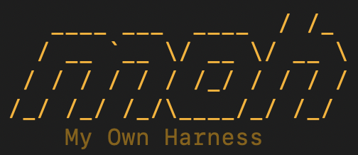

<div align="center">



# moh

**Your terminal, with a coding agent inside.**

moh is free software licensed under AGPL-3.0-or-later. See [LICENSE](LICENSE).

***Moh is 100% vibe-coded, with no preference between Western and Eastern
LLMs, because AI should be a common good, not a tool of geopolitical
power.***

[](https://github.com/Marco-Cricchio/moh/releases/latest)
[](LICENSE)

<div align="center">

</div>

*Runs on macOS and Linux, and on Windows via WSL · No Node, no Bun, no npm
required · 🌐 [moh.sh](https://moh.sh)*

</div>

## What is moh?

moh is a coding agent that lives in your terminal: you describe what you want,
moh reads your code, edits files, runs commands, and gets the work done —
showing every step and asking permission before anything risky.

- **Any provider.** Anthropic, OpenAI, Google, GitHub Copilot, OpenRouter,
  Kimi, xAI, hosted OpenAI-compatible endpoints, local models — with
  fallback chains if one goes down. Never locked to a vendor.
- **Your data stays yours.** An append-only log in `~/.moh/`: resume, fork,
  compact, or move any session. Nothing phoned home.
- **It asks before it acts.** Layered permissions gate every write and every
  command; extensions can veto but never grant more than you allowed.

## What's new

- **Development lanes** — git-backed parallel worktrees, one per task: spawn
  agents on separate lanes and integrate when you're ready.
- **Extension platform** — extensions are now first-class: a manifest with
  per-capability consent, slash commands, TUI panels and overlays, a
  registry (`moh extension add/list/remove`), and scoped powers (paths,
  hosts, keychain credentials, tools, endpoints) with an audited dependency
  installer.
- **Secret redaction** — secret-shaped values are masked unconditionally
  before anything is written to the session log.
- **Orchestration** — extensions can spawn and coordinate subagent sessions,
  and stop everything they started.
- **Retry on model errors** — a `onModelError` hook retries a failed call
  with same-tier candidates (Jev routing does this too).
- **Notes & polish** — the notes modal (ctrl+n) is now a real editor: cursor
  movement, word wrap, and inject-a-note-into-the-composer.

## Highlights

- **TUI** with file mentions (`@path`), images, session picker — or headless
  `moh run` for CI and scripts.
- **Built-in browser** with URL-scoped permissions and SSRF protection.
- **Project Map** — a structural map of your codebase backing change plans
  with citations.
- **Skills & workflow mode** — a bundled idea-to-shipped cycle (grill → spec
  → tickets → TDD → review) plus declarative GitHub repo management.
- **Make it yours** — a theme studio to build your own color themes with
  live previews and contrast checks.
- **Handoff between machines** — publish a session from one machine and pick
  it up on another with a single command.
- **Local usage telemetry** — `moh usage` reports per-model calls, tokens,
  costs and tool statistics, measured entirely on your machine: no data is
  ever sent anywhere.
- **Memory** that survives restarts; **subagents & MCP**.
- **An SDK, not just a tool** — embed the headless core as a library
  (`@moh/core`) in your own application, or drive it over RPC (`moh serve`):
  the same session can travel between your tooling, scripts, and the
  terminal.
- **Jev (opt-in)** — TypeSafe-powered judgment calls: bash guardrail, model
  routing, anti-injection, quality gate. Fails open.

→ Full docs: [docs/manual/](docs/manual/README.md) — ten bundled pages,
also readable in-app via the ask-moh guide agent.

## Install

No requirements — the binary is self-contained (macOS arm64/x64,
Linux x64/arm64):

```sh
curl -fsSL https://raw.githubusercontent.com/Marco-Cricchio/moh/main/scripts/install.sh | sh
```

or `brew install Marco-Cricchio/moh/moh`. On Windows there is no native
build: install [WSL](https://learn.microsoft.com/windows/wsl/install) and run
the same command inside the distro.

## Use moh

```sh
moh                      # interactive TUI, guided provider onboarding
moh run --allow bash     # headless, fail-fast, CI-ready
moh init                 # scaffold AGENTS.md + agent docs for your repo
```

Found a bug? `/report-bug` from the session, or
[open an issue](https://github.com/Marco-Cricchio/moh/issues/new/choose).

## Hack on moh

A monorepo of four packages around one rule: **all agent logic lives in the
headless core; every client is thin.** Build and test with Bun:

```sh
bun install && bun test && bun run typecheck
```

Read `docs/principles.md` first — seven principles govern every change;
decisions are recorded in `docs/adr/`.

## Acknowledgements

moh is an independent project. It ports the Matt Pocock agent workflow (MIT)
and David Lawson's gh-manager (MIT) as first-party skills.

## License

AGPL-3.0-or-later — see [LICENSE](LICENSE). Third-party material keeps its
own license (workflow skills: `packages/core/assets/skills/NOTICE.md`).
